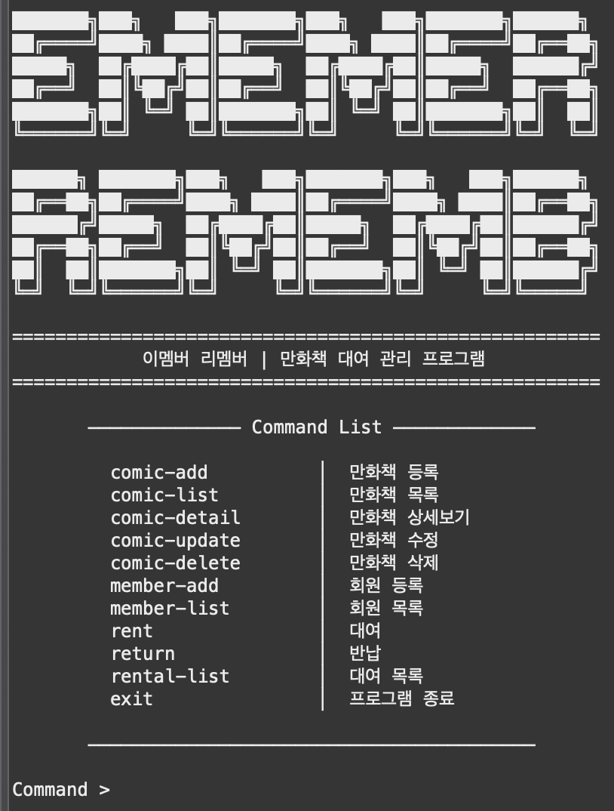

# 📖만화책 대여점 프로그램




## 1. 프로젝트 개요


본 프로젝트는 Java 콘솔(CLI) 환경에서 동작하는 **만화책 대여점 프로그램**을 구현하는 팀 과제입니다. 

사용자는 콘솔 명령어를 통해 만화책, 회원, 대여/반납 정보를 관리할 수 있으며, 데이터는 **MySQL + JDBC**를 통해 저장 및 조회됩니다.

이번 프로젝트를 통해 Java 기본 문법, 클래스 설계, 명령어 처리, JDBC를 활용한 데이터 베이스 연동 그리고 GitHub 기반 협업 과정을 함께 경험하는 것을 목표로 하였습니다.

## 2. 개발 환경


**Language**: Java

**Database**: MySQL

**DB Access**: JDBC

**IDE / Editor**: Eclipse, VS Code

**Version Control**: Git, GitHub

## 3. 개발 기간 및 협업 방식


#### 개발 기간

- 2026.03.04~2026.03.20

#### 협업 방식

- GitHub 저장소를 생성하여 팀원들과 함께 협업
- 기능 단위로 브랜치를 나누어 작업
- 커밋을 통해 변경 사항 기록
- Pull Request(PR)를 활용하여 코드 확인 및 병합
- 기능 구현뿐 아니라 공통 구조 통일, JDBC 전환, 통합 테스트 방향도 함께 조율

## 4. 팀원 구성과 역할


| 이름 | 담당 내용 | github |
| --- | --- | --- |
| 최준영 | CLI 통합, `rent`, `return` 기능 | @[**jychoi0831**](https://github.com/jychoi0831) |
| 김현우 | Comic CRUD 기능 | @[**gusdnzla26-art**](https://github.com/gusdnzla26-art) |
| 최윤석 | Member 기능 | @[**Yunseok3541** 최윤석](https://github.com/Yunseok3541) |
| 노윤희 | `rental-list`, 출력 포맷 정리, 테스트 시나리오, README 작성 | @[**sdg3729**](https://github.com/sdg3729) |

## 5. 프로젝트 구조


```jsx
AIBE5_WTL_COMIC/
├─ src/                           
│  ├─ app/
│  │  ├─ Main.java
│  │  └─ App.java
│  ├─ model/
│  │  ├─ Comic.java
│  │  ├─ Member.java
│  │  └─ Rental.java
│  └─ repository/
│     ├─ DBUtil.java
│     ├─ ComicRepository.java
│     ├─ MemberRepository.java
│     └─ RentalRepository.java
├─ image.png
└─ README.md                      
```

### 구조 설명

- `app` : 프로그램 실행 및 명령어 처리
- `model` : 만화책, 회원, 대여 데이터 클래스
- `repository` : JDBC를 이용한 DB 처리

## 6. 구현 기능


- 만화책 등록, 목록 조회, 상세 조회, 수정, 삭제
- 회원 등록 및 회원 목록 조회
- 만화책 대여 및 반납
- 대여 내역 조회
- 프로그램 종료

## 7. 사용 가능한 명령어


| 명령어 | 설명 |
| --- | --- |
| `comic-add` | 새 만화책을 등록합니다. (제목, 작가, 권수, 대여 가격 입력) |
| `comic-list` | 등록된 모든 만화책 목록을 조회합니다. |
| `comic-detail [comicId]` | 특정 만화책의 상세 정보를 조회합니다. (comicId를 입력) |
| `comic-update [comicId]` | 특정 만화책의 정보를 수정합니다. (comicId를 입력) |
| `comic-delete [comicId]` | 특정 만화책을 삭제합니다. (comicId를 입력) |
| `member-add` | 새 회원을 등록합니다. (이름, 연락처 입력) |
| `member-list` | 등록된 모든 회원 목록을 조회합니다. |
| `rent [comicId] [memberId]` | 특정 회원이 특정 만화책을 대여합니다. (comicId, memberId 입력) |
| `return [rentalId]` | 특정 대여 정보를 반납 처리합니다. (rentalId 입력) |
| `rental-list` | 모든 대여 내역을 조회합니다. |
| `exit` | 프로그램을 종료합니다. |

## 8. DB 설정 방법


### 8-1. DB 생성 및 스키마 실행

MySQL에서 아래 SQL을 실행하여 데이터베이스와 테이블을 생성합니다.

```jsx
CREATE DATABASE IF NOT EXISTS comic_rental;
USE comic_rental;

-- 1) 만화책 테이블 (comics)
CREATE TABLE IF NOT EXISTS comics (
  comic_id BIGINT AUTO_INCREMENT PRIMARY KEY,
  title VARCHAR(255) NOT NULL,
  author VARCHAR(255) NOT NULL,
  volume_number INT NOT NULL,
  rent_price INT NOT NULL,
  created_at DATE NOT NULL DEFAULT (CURRENT_DATE)
);

-- 2) 회원 테이블 (members)
CREATE TABLE IF NOT EXISTS members (
  member_id BIGINT AUTO_INCREMENT PRIMARY KEY,
  name VARCHAR(100) NOT NULL,
  phone VARCHAR(30) NOT NULL UNIQUE,
  reg_date DATE NOT NULL DEFAULT (CURRENT_DATE)
);

-- 3) 대여 기록 테이블 (rentals)
CREATE TABLE IF NOT EXISTS rentals (
  rent_id BIGINT AUTO_INCREMENT PRIMARY KEY,
  comic_id BIGINT NOT NULL,
  member_id BIGINT NOT NULL,
  rent_date DATE NOT NULL DEFAULT (CURRENT_DATE),
  return_date DATE NULL,

  CONSTRAINT fk_rentals_comic
    FOREIGN KEY (comic_id) REFERENCES comics(comic_id),

  CONSTRAINT fk_rentals_member
    FOREIGN KEY (member_id) REFERENCES members(member_id)
);

-- (선택) 테이블 생성 확인용
USE comic_rental;
SHOW TABLES;

SELECT *
FROM comics;

SELECT *
FROM members;

SELECT *
FROM rentals;
```

### 8-2. JDBC 접속 정보 설정

`DBUtil.java`에서 본인 MySQL 환경에 맞게 접속 정보를 설정합니다.

```jsx
private static final String URL = "jdbc:mysql://localhost:3306/comic_rental?serverTimezone=Asia/Seoul";
private static final String USER = "root";        // 본인 MySQL 계정으로 수정
private static final String PASSWORD = "1234";    // 본인 MySQL 비밀번호로 수정
```

### 8-3. 실행순서

1. MySQL에서 위 스키마 SQL 실행
2. `DBUtil.java` 접속 정보 수정
3. `app.Main` 실행
4. 콘솔에서 명령어 입력 후 기능 사용

## 9. 핵심 규칙


- `return_date == NULL`이면 **미반납(대여 중)** 상태로 판단합니다.
- 반납 예정일(`due_date`)은 **DB 컬럼으로 저장하지 않고**, `rent_date + 2일` 계산값으로 출력합니다.
- `return_date == NULL`이면 화면에는 `-`로 출력합니다.
- 날짜 형식은 `yyyy-MM-dd`로 출력합니다.
- `rental-list`는 `rent_id ASC` 기준으로 조회합니다.
- 대여 내역이 없으면 `=> 대여 내역이 없습니다.`를 출력합니다.

## 10. 실행 예시


```jsx
Command > rent
[만화책 대여] 정보를 입력하세요.
회원 번호: 1
만화책 번호: 1
[대여] [회원 번호: 1]님이 [만화책 번호: 1]를 대여하였습니다.

Command > rental-list
대여id | 만화id | 회원id | 대여일 | 반납일 | 반납예정일
------------------------------------------------------------
1 | 1 | 1 | 2026-03-10 | 2026-03-19 | 2026-03-12
2 | 2 | 2 | 2026-03-20 | 2026-03-20 | 2026-03-22
3 | 1 | 1 | 2026-03-20 | - | 2026-03-22

Command > return
[만화책 반납] 정보를 입력하세요.
만화책 번호: 1
[반납] [만화책 번호: 1]가 반납되었습니다.
```

## 11. 테스트 시나리오


### 11-1. 대여 내역이 없을 때

입력:

```
rental-list
```

예상 결과:

```
=> 대여 내역이 없습니다.
```

### 11-2. 대여 테스트

입력:

```
rent
회원 번호: 1
만화책 번호: 1
```

예상 결과:

- 대여가 정상 처리된다.
- 이미 대여 중인 만화책이면 대여가 제한된다.
- 존재하지 않는 회원 또는 만화책 번호 입력 시 오류 메시지가 출력된다.

### 11-3. 대여 목록 확인

입력:

```
rental-list
```

예상 결과:

- 대여 내역이 조회된다.
- `due_date`가 `rent_date + 2일`로 계산되어 출력된다.
- 반납 전이면 `return_date`는 `-`로 출력된다.

### 11-4. 반납 테스트

입력:

```
return
만화책 번호: 1
```

예상 결과:

- 반납이 정상 처리된다.
- 대여 이력이 없는 만화책이면 안내 문구가 출력된다.
- 이미 반납된 만화책이면 안내 문구가 출력된다.

### 11-5. 반납 후 목록 재확

입력:

```
rental-list
```

예상 결과:

- 반납일이 실제 날짜로 저장되어 출력된다.

## 12. 느낀점 및 개선방향


이번 프로젝트를 통해 Java 콘솔 프로그램의 구조, 명령어 기반 입력 처리 방식, MySQL 테이블 설계, JDBC 연결 및 조회 과정을 직접 경험할 수 있었습니다.

특히 팀 프로젝트에서는 기능 구현 자체뿐 아니라, **공통 구조를 맞추고 각자의 기능을 하나의 흐름으로 통합하는 과정**이 매우 중요하다는 점을 느낄 수 있었습니다.

앞으로는 다음과 같은 방향으로 보완할 수 있습니다.

- 출력 형식 통일성 개선
- 추가 기능 개발 제안
    - 연체료 계산 기능
    - 검색 기능
    - 회원별 대여 내역 조회 기능
    - 연체 목록 출력 기능